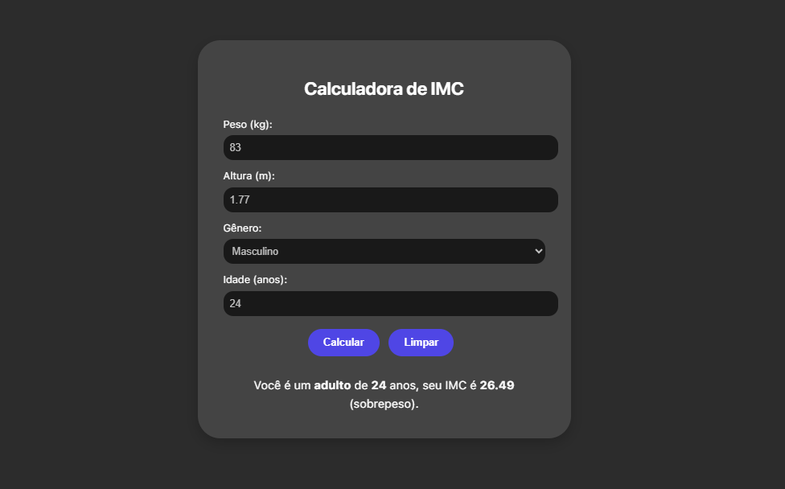

# 💪 Calculadora de IMC

Uma calculadora moderna e responsiva de IMC (Índice de Massa Corporal), feita com HTML, CSS e JavaScript.  
Esse projeto foi aprimorado com base em uma versão anterior, ganhando mais interatividade, responsividade, design limpo e funcionalidades extras.

### 🔗 Acesse o projeto online:
➡️ [oggfelpz.github.io/Calculadora-de-IMC](https://oggfelpz.github.io/Calculadora-de-IMC/)

---

## ✨ Funcionalidades

- ✅ Cálculo automático do IMC com base no peso e altura
- 👤 Campo para **idade**
- ⚧️ Seleção de **gênero** (masculino ou feminino)
- 📱 Design **responsivo** para mobile e desktop
- 🎨 Visual **moderno e dark** com micro-animações e efeitos de `hover`
- 💬 Mensagem personalizada baseada na idade, gênero e faixa do IMC
- 🧹 Botão para **limpar** todos os campos e o resultado

---

## 📸 Preview

---

## 🛠️ Tecnologias usadas

- HTML5
- CSS3
- JavaScript (puro)

---

## 📁 Estrutura de pastas

Calculadora-de-IMC/
│
├── index.html
├── CSS/
│ └── styles.css
├── JS/
│ └── script.js
└── fonts/
└── SF-Pro.ttf

---

## 📌 Melhorias futuras (ideias)

- [ ] Adicionar gráfico visual para o IMC
- [ ] Tradução para outros idiomas
- [ ] Tema claro/escuro com botão de alternância
- [ ] Acessibilidade com suporte a leitores de tela

---

## 👨‍💻 Autor

Desenvolvido por [oggfelpz](https://github.com/oggfelpz) 🧠  
Esse projeto faz parte do meu aprendizado como desenvolvedor;

